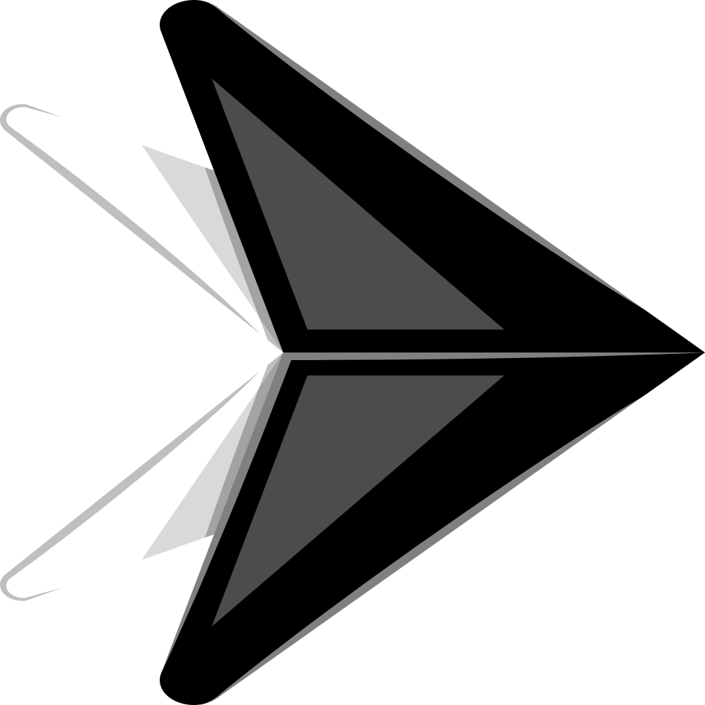

<a name="readme-top"></a>


<!-- PROJECT SHIELDS -->
<!--
*** I'm using markdown "reference style" links for readability.
*** Reference links are enclosed in brackets [ ] instead of parentheses ( ).
*** See the bottom of this document for the declaration of the reference variables
*** for contributors-url, forks-url, etc. This is an optional, concise syntax you may use.
*** https://www.markdownguide.org/basic-syntax/#reference-style-links
-->
[![Contributors][contributors-shield]][contributors-url]
[![Forks][forks-shield]][forks-url]
[![Stargazers][stars-shield]][stars-url]
[![Issues][issues-shield]][issues-url]
[![MIT License][license-shield]][license-url]
[![LinkedIn][linkedin-shield]][linkedin-url]


<!-- PROJECT LOGO -->
<br />
<div align="center">
  <a href="https://github.com/AshminJayson/zfetch">
    
  </a>

<h3 align="center">_Z Fetch</h3>

  <p align="center">
    🖇️ Persistent clipboard with fuzzy search built using NextJS with Tauri
    <br />
    <a href="https://github.com/AshminJayson/zfetch"><strong>Explore the docs »</strong></a>
    <br />
    <br />
    <!-- <a href="https://github.com/AshminJayson/zfetch">View Demo</a> -->
    <!-- · -->
    <a href="https://github.com/AshminJayson/zfetch/issues">Report Bug</a>
    ·
    <a href="https://github.com/AshminJayson/zfetch/issues">Request Feature</a>
  </p>
</div>


<!-- TABLE OF CONTENTS -->
<details>
  <summary>Table of Contents</summary>
  <ol>
    <li>
      <a href="#about-the-project">About The Project</a>
      <ul>
        <li><a href="#built-with">Built With</a></li>
      </ul>
    </li>
    <li>
      <a href="#getting-started">Getting Started</a>
      <ul>
        <li><a href="#prerequisites">Prerequisites</a></li>
        <li><a href="#installation">Installation</a></li>
      </ul>
    </li>
    <li><a href="#usage">Usage</a></li>
    <li><a href="#roadmap">Roadmap</a></li>
    <li><a href="#contributing">Contributing</a></li>
    <li><a href="#license">License</a></li>
    <li><a href="#contact">Contact</a></li>
    <li><a href="#acknowledgments">Acknowledgments</a></li>
  </ol>
</details>


<!-- ABOUT THE PROJECT -->
## About The Project

[![Z Fetch][product-screenshot]](https://example.com)


<p align="right">(<a href="#readme-top">back to top</a>)</p>


### Built With
Next was preferred cause it's popular and Tauri cause it's fast 🦀
* [![Next][Next.js]][Next-url]
* [![Tauri][Tauri]][Tauri-url]

<p align="right">(<a href="#readme-top">back to top</a>)</p>


<!-- GETTING STARTED -->
## Getting Started


### Prerequisites

Follow the steps below to setup a local development environment
* Clone the repo
    ```sh
    git clone https://github.com/AshminJayson/zfetch
    ```
* Move to repo directory
    ```sh
    cd zfetch
    ```
* Install the npm packages
    ```sh
    npm install
    ```
* Run the development server
    ```sh
    npm run tauri dev
    ```

<!-- ### Installation -->


<!-- USAGE EXAMPLES -->
## Usage

* Download and run the installer from https://github.com/AshminJayson/zfetch/releases
* Add whatever required key and value pairs as needed
* Search for those, selected fields automatically get copied to your clipboard ( I'm be checking if this is really is better than having to press enter after making a selection )


<p align="right">(<a href="#readme-top">back to top</a>)</p>


<!-- ROADMAP -->
<!-- ## Roadmap

- [ ] Feature 1
- [ ] Feature 2
- [ ] Feature 3
    - [ ] Nested Feature

See the [open issues](https://github.com/AshminJayson/zfetch/issues) for a full list of proposed features (and known issues).

<p align="right">(<a href="#readme-top">back to top</a>)</p>
-->


<!-- CONTRIBUTING -->
## Contributing

Contributions are what make the open source community such an amazing place to learn, inspire, and create. Any contributions you make are **greatly appreciated**.

If you have a suggestion that would make this better, please fork the repo and create a pull request. You can also simply open an issue with the tag "enhancement".
Don't forget to give the project a star! Thanks again!

1. Fork the Project
2. Create your Feature Branch (`git checkout -b feature/AmazingFeature`)
3. Commit your Changes (`git commit -m 'Add some AmazingFeature'`)
4. Push to the Branch (`git push origin feature/AmazingFeature`)
5. Open a Pull Request

<p align="right">(<a href="#readme-top">back to top</a>)</p>


<!-- LICENSE -->
<!-- ## License

Distributed under the MIT License. See `LICENSE.txt` for more information.

<p align="right">(<a href="#readme-top">back to top</a>)</p> -->


<!-- CONTACT -->
## Contact

Ashmin Jayson - [@JaysonAshmin](https://twitter.com/JaysonAshmin) - ashminjayson10@gmail.com

Project Link: [https://github.com/AshminJayson/zfetch](https://github.com/AshminJayson/zfetch)

<p align="right">(<a href="#readme-top">back to top</a>)</p>


<!-- ACKNOWLEDGMENTS -->
## Acknowledgments

* [Tauri + SQLite Reference](https://blog.moonguard.dev/how-to-use-local-sqlite-database-with-tauri)

<p align="right">(<a href="#readme-top">back to top</a>)</p>


<!-- MARKDOWN LINKS & IMAGES -->
<!-- https://www.markdownguide.org/basic-syntax/#reference-style-links -->
[contributors-shield]: https://img.shields.io/github/contributors/AshminJayson/zfetch.svg?style=for-the-badge
[contributors-url]: https://github.com/AshminJayson/zfetch/graphs/contributors
[forks-shield]: https://img.shields.io/github/forks/AshminJayson/zfetch.svg?style=for-the-badge
[forks-url]: https://github.com/AshminJayson/zfetch/network/members
[stars-shield]: https://img.shields.io/github/stars/AshminJayson/zfetch.svg?style=for-the-badge
[stars-url]: https://github.com/AshminJayson/zfetch/stargazers
[issues-shield]: https://img.shields.io/github/issues/AshminJayson/zfetch.svg?style=for-the-badge
[issues-url]: https://github.com/AshminJayson/zfetch/issues
[license-shield]: https://img.shields.io/github/license/AshminJayson/zfetch.svg?style=for-the-badge
[license-url]: https://github.com/AshminJayson/zfetch/blob/master/LICENSE.txt
[linkedin-shield]: https://img.shields.io/badge/-LinkedIn-black.svg?style=for-the-badge&logo=linkedin&colorB=555
[linkedin-url]: https://linkedin.com/in/ashmin-jayson
[product-screenshot]: public/screenshot.png
[Next.js]: https://img.shields.io/badge/next.js-000000?style=for-the-badge&logo=nextdotjs&logoColor=white
[Next-url]: https://nextjs.org/
[Tauri]: https://img.shields.io/badge/tauri-%2324C8DB.svg?style=for-the-badge&logo=tauri&logoColor=%23FFFFFF
[Tauri-url]: https://tauri.app/
